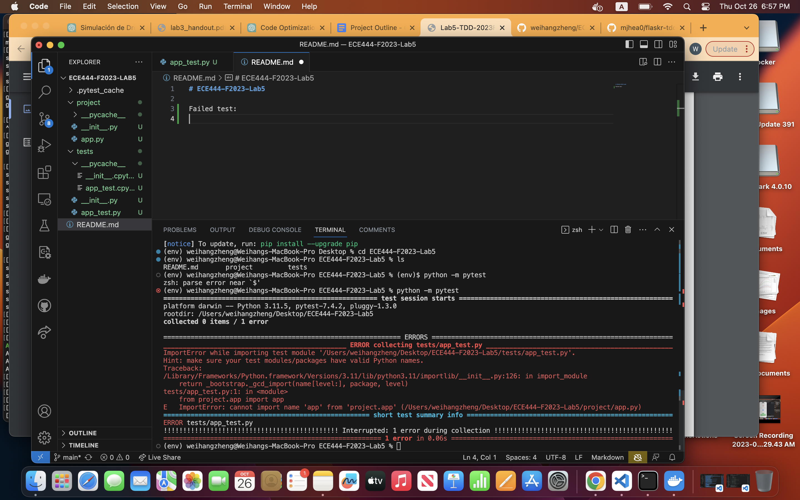
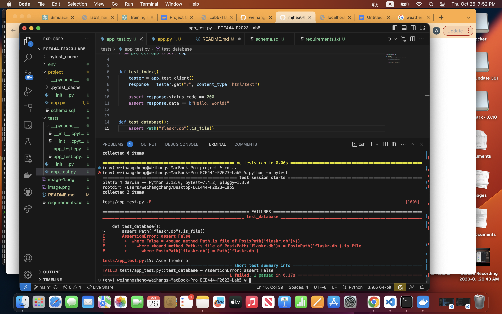

# ECE444-F2023-Lab5

## Part 1:

### First test:

**Failed test:**  

**Succeeded test:**  

### Database setup:

**Failed test:**  

**Succeeded test:**  

### Templates and views:

**All test:**  

**Two errors:**  

**Succeeded test:**  

### Add some style:

**Login:**  

**Add Post:**  

**Add two:**  

**Delete:**  

**Test Pass:**  

**Bootstrap:**  

### SQLAlchemy:

**test:**  

## Part 2:

My test case:  
[GitHub - ECE444-2023Fall/project-1-web-application-design-group4-3d3g: Test Case](https://github.com/ECE444-2023Fall/project-1-web-application-design-group4-3d3g/blob/main/tests/test_app.py#L43-#L54)

## Part 3:

**Pros and Cons of Test Driven Development:**

There are numerous advantages to using TDD. These include enhanced code quality in terms of structure, modularity, and functionality. Because the purpose of the code is clearly defined, it's likely to have fewer bugs. Additionally, the tests themselves act as documentation, since examining the test cases provides insight into the expected inputs and outputs of the modularized components.

However, TDD is not without its drawbacks, primarily due to the added overhead. TDD presents a learning curve for newcomers and consumes time that might otherwise be allocated to direct development without the preliminary step of writing test cases. Once tests are created, they require ongoing maintenance. Additionally, the scope of testing has limitations; certain elements, such as the user interface, may not be effectively tested. The final issue is the potential for over-engineering, which entails writing superfluous code solely to satisfy test requirements.
